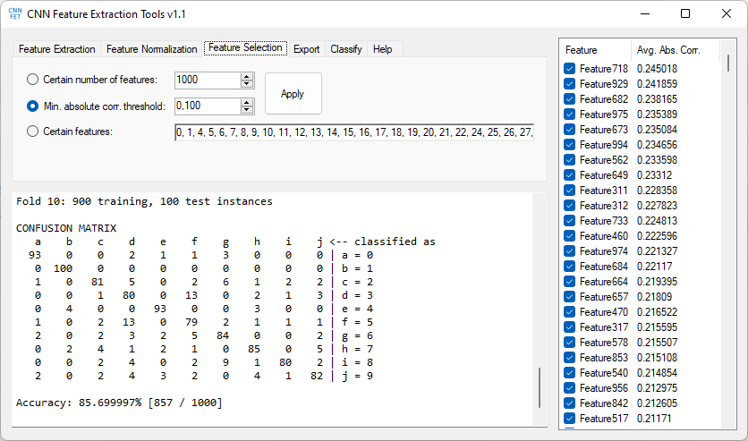

# CNNFET
CNNFET (Convolutional Neural Network Feature Extraction Tools) is a standalone Windows application that utilizes pretrained convolutional neural networks (CNN) for feature extraction. It reads datasets from directories, extract features, sorts them by their relevances, eliminates irrelevant features, classify instances and can export them for further analysis on Matlab or a well-known machine learning tool; Weka. It does not require coding experience or deep knowledge about CNNs and can be used by researchers from various disciplines.

You can cite the paper below if you use CNNFET or CeNiN in your work:
> Atasoy, H., & Kutlu, Y. (2025). CNNFET: Convolutional neural network feature Extraction Tools. SoftwareX, 30, 102088. https://doi.org/10.1016/j.softx.2025.102088

## Version History
### v1.1
- Feature normalization tab
- Removed layer suggestion
- Faster file export
- Regex support for class name extraction

[CNNFET+open_blas_x64.zip (6.59MB)](CNNFET+open_blas_x64.zip)

CNNFET uses [CeNiN](https://github.com/atasoyhus/CeNiN) to pass images through CNN layers. For more information about CeNiN please click [here](https://github.com/atasoyhus/CeNiN).

## Pretrained CNN models
- [imagenet-matconvnet-vgg-f.cenin (19 layers, 60824256  weights, 232MB)](https://drive.google.com/file/d/12Z0zkcLFMAvReBYomj1thrU-Aj1EJYKZ/view?usp=sharing)
- [imagenet-vgg-verydeep-16.cenin (37 layers, 138344128 weights, 528MB)](https://drive.google.com/file/d/1t3Z3v1D625fByha19avQpNEiJm1AI-fD/view?usp=sharing)

## Using CNNFET
### Organising The Dataset
CNNFET scans selected directory and inner folders for images that have one of the extensions jpg, jpeg, png or bmp. Class names are extracted from directory names or file names depending on the "Class name pattern" option or the regex pattern that can be written by the user.

### Feature Extraction
- Pretrained CNN models in supported formats are listed above. Download one of them and load it
- Select the convolution layer where passing the image will be stopped and the output will be considered as features. You can visualize filters in the selected layer clicking "Visualize" button.
- Select the directory that contains folders and images in that folders. If you want to limit the number of images for each class, check "Instance limit per class" and click "Rescan" button.
- Click "Extract Features" to start the extracting process

### Feature Normalization
In this tab, features can be normalized to the range [0, 1]. If a seperate test dataset should be normalized using min-max values of a training dataset, minimum and maximum values can be copied and entered manually.

### Feature Selection
When this tab is clicked, the features are sorted by the absolute correlation values from high to low. You can skip this tab or you can apply one of these filters:
- ***Certain number of features:*** The first n features that have the highest correlations are selected.
- ***Min. absolute corr. threshold:*** The features of which correlations are greater than or equal to the threshold value are selected. The features that have lower than the threshold are eliminated.
- ***Certain features:*** The features of which indexes are written manually are selected.

### Export
You can export extracted features and classes in .arff (for Weka) or .m file (for Matlab) formats.

### Classify
Instances can be classified by the application using the k-nearest neighbors (kNN) algorithm. This is the only classifier implemented in CNNFET yet. You can change the number of folds and the k value for the kNN. The dataset is splitted into selected number of test and train subsets and the classification performed on every training and test set pairs.
